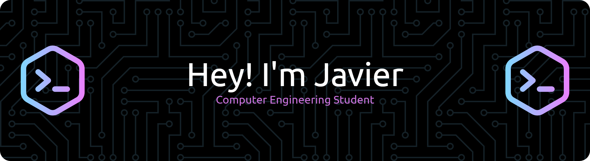

<span align="center">
  
  <p align="center"> Available in: <a href="./README.en.md">English</a> | <a href="./README.md">Español</a></p>
</span>

# ✌️ About me

```python
class Javier:
    def __init__(self):
        self.name = "Javier"
        self.surname = "Rosales Lozano"
        self.role = "Computer Engineering Student @ UC3M"
        self.year = 4
        self.residence = "Madrid"
    def __str__(self):
        return f"{self.name} - {self.role}"

if __name__ == "__main__":
    me = Javier()
```

<p>
  My professional goal is to fully develop myself as a <strong>computer engineer</strong>, taking part in technological and innovative projects where I can apply my knowledge and skills to create value, enjoy my work, and maintain a balance between stability and professional growth.
</p>
<p>
  I am motivated by the trust and support I have received throughout my education, and I aim to give back through effort and dedication. I understand that achieving my goals requires perseverance and discipline, so it is up to me to stay motivated and actively pursue my objectives, learning and growing every day.
</p>

# 🔧 Knowledges and Capacities

<p>
  Throughout my university studies, I've been specialized in the following technologies:
  <p align="center">
    <a href="https://skillicons.dev">
      
    </a>
  </p>
</p>
<p>
  Besides other skills, I have managed also:
  <p align="center">
    <a href="https://skillicons.dev">
      
    </a>
  </p>
</p>
<p>
  Finally, when it comes to working, I'm drawing on the next tools:
  <p align="center">
    <a href="https://skillicons.dev">
      
    </a>
  </p>
</p>

# 💻 Outstanding Projects

<table>
  <tr>
    <th align="center">Projects</th>
    <th>Summary</th>
    <th>Used Technologies</th>
  </tr>
  <tr>
    <td align="center"><a href="https://github.com/JRosales04/myhomie-app.git">myhomie-app</a></td>
    <td>Creation of an interactive system controlled via mobile gestures, designed to manage home automation.</td>
    <td align="center">
      
    </td>
  </tr>
  <tr>
    <td align="center"><a href="https://github.com/JRosales04/mydiary-crypto">mydiary-crypto</a></td>
    <td>Development of a user registration/authentication system with encryption of personalized notes and an advanced Tkinter interface.</td>
    <td align="center">
      
    </td>
  </tr>
  <tr>
    <td align="center"><a href=https://github.com/JRosales04/employee-attrition-prediction.git>employee-attrition-prediction</a></td>
    <td>Employee churn prediction model based on company statistics and employee attributes.</td>
    <td align="center">
      
    </td>
  </tr>
  <tr>
    <td align="center"><a href=https://github.com/JRosales04/p2p-dss.git>p2p-dss</a></td>
    <td>Design and deploy of a P2P architecture between Python clients and a C server for file distribution services, with extensions including web services and RPC server.</td>
    <td align="center">
      
    </td>
  </tr>
</table>

<p>
  My coding standards focus on:
    <li><strong>Code optimization</strong> and efficient software design.</li>
    <li><strong>Test development</strong>, robust programming, and best maintenance practices.</li>
    <li>Integrating modern technologies and building <strong>scalable applications</strong>.</li>
    <li>Solving complex problems through <strong>creative and efficient solutions</strong>.</li>
</p>

# 📬 Connect with me!

<p align="center">
  <a href="./docs/cv_en.pdf" target="_blank">
    
  </a>
  <a href="http://www.linkedin.com/in/javierrosaleslozano">
    
  </a>
  <a href="https://github.com/JRosales04">
    
  </a>
  <a href="mailto:javierrl20047@gmail.com">
    
  </a>
</p>

<p align="center">
  
</p>

<h4 align="center">
  "Focused on the process, not the outcome."
  
</h4>
