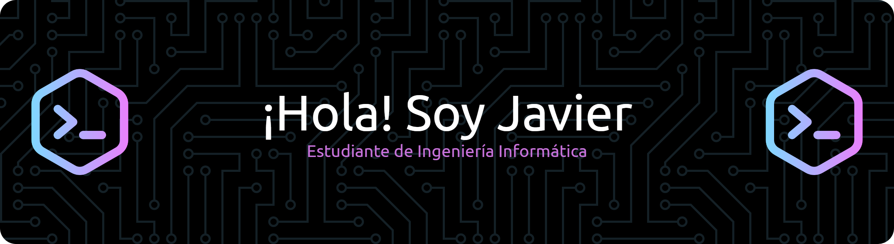

<span align="center">
  
  <p align="center"> Disponible en: <a href="./README.md">Español</a> | <a href="./README.en.md">English</a></p>
</span>

# :metal: Sobre mí

```python
class Javier:
    def __init__(self):
        self.name = "Javier"
        self.surname = "Rosales Lozano"
        self.role = "Computer Engineering Student @ UC3M"
        self.year = 4
        self.residence = "Madrid"
    def __str__(self):
        return f"{self.name} - {self.role}"

if __name__ == "__main__":
    me = Javier()
```

<p>
  Mi objetivo profesional es desarrollarme plenamente como <strong>ingeniero informático</strong>, participando en proyectos tecnológicos e innovadores donde pueda aplicar mis conocimientos y habilidades para generar valor, disfrutar de mi trabajo y mantener un equilibrio entre estabilidad y crecimiento profesional.
</p>
<p>
  Me motiva la confianza y el apoyo recibido a lo largo de mi formación, y deseo devolverlo con esfuerzo y dedicación. Comprendo que alcanzar mis metas requiere constancia y disciplina, por lo que depende de mí mantener la motivación y perseguir activamente mis objetivos, aprendiendo y creciendo cada día
</p>

# :wrench: Aptitudes

<p>
  Las diferentes tecnologías en las que me he especializado durante la carrera son:
  <p align="center">
    <a href="https://skillicons.dev">
      
    </a>
  </p>
</p>
<p>
  Entre otros conocimientos secundarios que he adquirido, se encuentran:
  <p align="center">
    <a href="https://skillicons.dev">
      
    </a>
  </p>
</p>
<p>
  Y, a la hora de trabajar, me apoyo en las siguientes herramientas de trabajo:
  <p align="center">
    <a href="https://skillicons.dev">
      
    </a>
  </p>
</p>

# :briefcase: Experiencia Profesional

<h4>Maquetador Web: Diseño UI/UX</h4>

<table>
  <tr>
    <td style="vertical-align: center; width: 65%;">
      <p>Prácticas Académicas Externas<br><strong>10/2025 - Actual</strong></p>
      <p>
        Becario en el <strong>equipo de Producto de Smartvel</strong>, colaborando en la personalización técnica de widgets y microsites para clientes reales del sector turístico y tecnológico. Mi trabajo consiste en adaptar estilos de diseño a la identidad del cliente, partiendo del <strong>estudio de marca</strong> y garantizando coherencias con <strong>guías de diseño y estándares UI/UX</strong>. También se pone énfasis en el <strong>diseño responsive (móvil, tablet y desktop)</strong>, solucionando incidencias visuales y de compatibilidad entre navegadores. Se realizan <strong>pruebas de usabilidad y accesibilidad</strong> aplicando criterios de diseño inclusivo y validación WCAG, evaluando contraste, legibilidad, navegación por teclado y estructura semántica para asegurar una experiencia más usable para todos los usuarios.
      </p>
    </td>
    <td width="35%" style="vertical-align: center;">
      
      <div style="display:flex; flex-direction: row; justify-content: space-between; align-items: center;">
        <ul>
          <li><strong>Empresa:</strong> <a href="https://www.smartvel.com/es/inicio">Content Trip Solutions S.L., Smartvel</a></li>
          <li><strong>Tecnologías:</strong></li>
          <br>
          
        </ul>
      </div>
    </td>
  </tr>
</table>

# :bulb: Proyectos Destacados

<table>
  <tr>
  <th align="center" />Proyectos
    <th>Descripción</th>
    <th>Tecnologías aplicadas</th>
  </tr>
  <tr>
    <td align="center"><a href="https://github.com/JRosales04/myhomie-app.git">myhomie-app</a></td>
    <td>Creación de un sistema interactivo manejable a través de gestos con el teléfono móvil, con el propósito de controlar la domótica de un hogar.</td>
    <td align="center">
      
    </td>
  </tr>
  <tr>
    <td align="center"><a href=https://github.com/JRosales04/mydiary-crypto>mydiary-crypto</a></td>
    <td>Desarrollo de un sistema de registro/autenticación de usuarios y cifrado de notas personalizadas con interfaz avanzada en Tkinter.</td>
    <td align="center">
      
    </td>
  </tr>
  <tr>
    <tr>
    <td align="center"><a href=https://github.com/JRosales04/employee-attrition-prediction.git>employee-attrition-prediction</a></td>
    <td>Modelo de predicción de abandono de empleados de una empresa en base a estadísticas y atributos de éstos.</td>
    <td align="center">
      
    </td>
  </tr>
    <td align="center"><a href=https://github.com/JRosales04/p2p-dss.git>p2p-dss</a></td>
    <td>Arquitectura P2P entre clientes de Python y servidor de C para el servicio de distribución de ficheros; ampliación con servicios web y servidor RPC.</td>
    <td align="center">
      
    </td>
  </tr>
</table>

<p>
  Mis estándares de código se centran en:
  <ul style="column-count: 2; column-gap: 1rem;">
    <li>La <strong>optimización de código</strong> y el diseño eficiente y limpio de software.</li>
    <li>El <strong>desarrollo de pruebas</strong>, programación robusta y buenas prácticas de mantenimiento.</li>
    <li>La integración de tecnologías modernas y la creación de <strong>aplicaciones escalables</strong>.</li>
    <li>La resolución de problemas complejos mediante <strong>soluciones creativas y eficientes</strong>.</li>
  </ul>
</p>

# :chart_with_upwards_trend: Estadísticas

<p>
  Últimamente, pongo a prueba mis habilidades y conocimientos en <a href="https://leetcode.com/u/jrosales04/">Leetcode</a>. Puedes ver mi progreso diario a continuación:
</p>

<div align="center" style="display: flex; justify-content: center; gap: 20px; align-items: center; flex-wrap: nowrap;">
  
</div>

# :mailbox: ¡Pongámonos en contacto!

<p align="center">
  <a href="./docs/cv_es.pdf" target="_blank">
    
  </a>
  <a href="http://www.linkedin.com/in/javierrosaleslozano">
    
  </a>
  <a href="https://github.com/JRosales04">
    
  </a>
  <a href="mailto:javierrl20047@gmail.com">
    
  </a>
</p>

<p align="center">
  
</p>

<h4 align="center">
  "Concentrado en el proceso, no en el resultado."
  
</h4>
